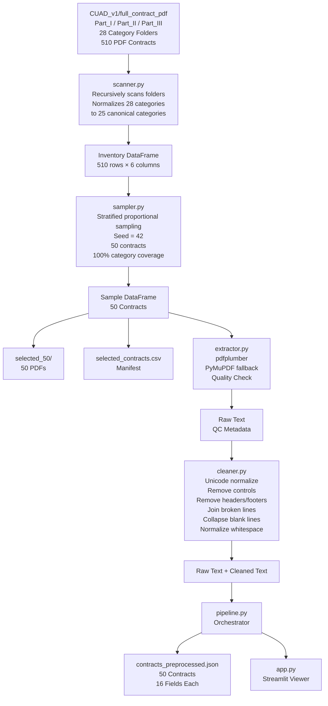
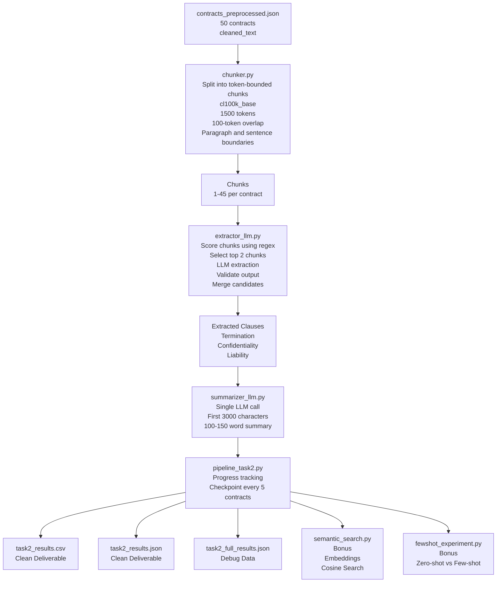

# CUAD Preprocessing Pipeline — Task 1

End-to-end data loading, preprocessing, and selection for the  
**Contract Understanding Atticus Dataset (CUAD v1)**.

This pipeline produces a clean, 50-contract JSON file ready for downstream  
LLM-based clause extraction (Task 2).

---

## Pipeline flow diagram



---

## Project structure

```
Legal-Contract-Intelligence-Pipeline/
│
│  Configuration
├── .env                      # Your local paths and settings (copy from .env.example)
├── .env.example              # Template — fill in your paths and commit this
├── config.py                 # Loads .env and exposes typed constants
│
│  Task 1 — Data loading, preprocessing, selection
├── scanner.py                # Folder scan, category normalisation, inventory
├── sampler.py                # Stratified 50-contract sampling + PDF copy
├── extractor.py              # PDF text extraction (pdfplumber + PyMuPDF)
├── cleaner.py                # Text normalization (unicode, headers, whitespace)
├── pipeline.py               # Task 1 orchestrator — run this first
│
│  Task 2 — LLM extraction and summarization
├── chunker.py                # Split cleaned_text into token-bounded chunks
├── ollama_client.py          # HTTP wrapper for Ollama REST API
├── extractor_llm.py          # Clause extraction: keyword ranking + LLM
├── summarizer_llm.py         # Contract summarization via LLM
├── pipeline_task2.py         # Task 2 orchestrator with checkpointing
│
│  Bonus features
├── semantic_search.py        # Embed clauses + cosine similarity search
├── fewshot_experiment.py     # Zero-shot vs few-shot extraction comparison
│
│  Viewer
├── app.py                    # Streamlit app (4 tabs)
│
│  Outputs (generated — not committed to git)
├── contracts_preprocessed.json   # Task 1 output
├── task2_results.csv             # Task 2 main deliverable
├── task2_results.json            # Task 2 as JSON
├── task2_full_results.json       # Debug: per-chunk intermediates
├── semantic_store.npz            # Clause embeddings
│
│  Documentation
├── requirements.txt
├── README.md
```

---

## Prerequisites

Python 3.10+ is required.

```bash
pip install -r requirements.txt
```

> **Note on Pillow/Streamlit conflict**: `pdfplumber 0.11.x` requires
> `Pillow >= 12`, while `streamlit 1.45` pins `Pillow < 12`. Both packages
> still work correctly despite the resolver warning because the app does not
> use any image-rendering features of either library. Alternatively, upgrade
> to `streamlit >= 2.0` which removes the Pillow restriction.

---

## Configuration

Copy `.env.example` to `.env` and fill in your paths:

```bash
cp .env.example .env   # Linux/Mac
copy .env.example .env  # Windows
```

Then edit `.env`:

```dotenv
# Point this at wherever you downloaded and unzipped CUAD_v1
CUAD_BASE_PATH=/your/path/to/CUAD_v1

# These can stay relative to CUAD_BASE_PATH
SELECTED_OUTPUT_DIR=/your/path/to/CUAD_v1/selected_50
PREPROCESSED_OUTPUT_PATH=/your/path/to/Legal-Contract-Intelligence-Pipeline/contracts_preprocessed.json

RANDOM_SEED=42
SAMPLE_SIZE=50
```

All paths in every module are derived from `.env` — nothing is hardcoded in source files.

---

## Running the pipeline

```bash
cd Legal-Contract-Intelligence-Pipeline
python pipeline.py
```

What the script does, step by step:

| Step | Module                        | Output                                                             |
| ---- | ----------------------------- | ------------------------------------------------------------------ |
| 1    | `scanner.py`                  | In-memory inventory DataFrame (510 rows, 25 normalised categories) |
| 2    | `sampler.py`                  | Stratified random sample of 50 contracts                           |
| 3    | `sampler.py`                  | Copies 50 PDFs → `selected_50/`, writes `selected_contracts.csv`   |
| 4    | `extractor.py` + `cleaner.py` | Extracts & cleans text for each contract                           |
| 5    | `pipeline.py`                 | Writes `contracts_preprocessed.json`                               |

Expected runtime: **2–5 minutes** depending on disk speed.

> **Cache note**: if you re-run `pipeline.py` after any scanner/category changes,
> a browser refresh is enough — you do **not** need to restart Streamlit.
> The app keys its `@st.cache_data` on the JSON file's modification timestamp,
> so it automatically picks up the new file on the next page load.

---

## Output schema — `contracts_preprocessed.json`

The file has three top-level keys:

```json
{
  "__schema__": { "field_name": "description", ... },
  "metadata":   { "total_contracts": 50, "random_seed": 42, ... },
  "contracts":  [ { ...record... }, ... ]
}
```

### Per-contract fields

| Field                 | Type        | Description                                                                |
| --------------------- | ----------- | -------------------------------------------------------------------------- |
| `contract_id`         | string      | Filename stem (no extension) — unique ID                                   |
| `category`            | string      | **Normalised** category name — near-duplicates collapsed (see table below) |
| `category_raw`        | string      | Original folder name on disk before normalisation                          |
| `part`                | string      | Dataset part: `"Part_I"`, `"Part_II"`, or `"Part_III"`                     |
| `original_pdf_path`   | string      | Absolute path to the source PDF                                            |
| `file_size_kb`        | float       | Source PDF size in KB                                                      |
| `extraction_method`   | string      | `"pdfplumber"` or `"pymupdf"`                                              |
| `char_count`          | int         | Character count of `cleaned_text`                                          |
| `raw_char_count`      | int         | Character count of `raw_text`                                              |
| `txt_reference_found` | bool        | Whether a `.txt` reference was found in `full_contract_txt/`               |
| `txt_char_count`      | int         | Char count of reference `.txt` (0 if not found)                            |
| `extraction_ratio`    | float\|null | `char_count / txt_char_count` — values < 0.3 are flagged                   |
| `quality_flagged`     | bool        | `true` if extraction looks suspicious                                      |
| `quality_flag_reason` | string      | Human-readable flag explanation (empty if not flagged)                     |
| `raw_text`            | string      | Full text from PDF extractor (unicode-normalized, no structural changes)   |
| `cleaned_text`        | string      | Fully normalized text — **this is what Task 2 should consume**             |

### Category normalisation

The CUAD dataset has inconsistent folder names across its three Parts.
`scanner.py` collapses 28 raw folder names into 25 canonical categories:

| Raw folder name          | Canonical name          | Issue                            |
| ------------------------ | ----------------------- | -------------------------------- |
| `Affiliate Agreement`    | `Affiliate_Agreements`  | Part_III singular vs Part_I      |
| `Endorsement Agreement`  | `Endorsement`           | Part_III extra word vs Part_I/II |
| `Joint Venture _ Filing` | `Joint_Venture`         | Part_III variant name            |
| `Strategic Alliance`     | `Strategic_Alliance`    | space → underscore               |
| `Agency Agreements`      | `Agency_Agreements`     | space → underscore               |
| `Consulting Agreements`  | `Consulting_Agreements` | space → underscore               |

The original folder name is always preserved in `category_raw` for traceability.

### `cleaned_text` cleaning steps

1. Unicode NFC normalization; ligature / smart-quote replacement
2. Remove non-printable control characters
3. Strip repetitive page headers / footers / page-number lines
4. Join PDF-broken lines (mid-sentence line wraps)
5. Collapse excess blank lines (≥ 3 → 2)
6. Normalize horizontal whitespace (tabs → space, multi-space → single space)

`raw_text` is preserved verbatim so nothing is irreversibly lost.

---

## Launching the Streamlit viewer

```bash
cd Legal-Contract-Intelligence-Pipeline
streamlit run app.py
```

The browser will open automatically at `http://localhost:8501`.

### Viewer features

- **Summary tab** — total contracts, avg/min/max char count,
  category bar chart, part breakdown pivot table, full contract list
  (quality-flagged rows highlighted in red).
- **Contract Explorer tab** — select any contract from a dropdown,
  view raw vs cleaned text side-by-side, see extraction metadata and
  quality-check results.
- **Sidebar filters** — filter by category, part, and quality flag status.

---

## Reproducibility

The sample is fully deterministic: `RANDOM_SEED=42` is passed to both
`DataFrame.sample()` calls in `sampler.py`. Re-running `pipeline.py`
with the same seed and dataset always selects the same 50 contracts.

---

# Task 2 — LLM Clause Extraction & Summarization

Reads `contracts_preprocessed.json` (Task 1 output) and uses **qwen2.5:1.5b**
running locally via [Ollama](https://ollama.com) to extract three clause types
and generate a 100-150 word summary for each contract.

---

## Task 2 pipeline flow



---

## Prerequisites

### 1. Install Ollama

Download and install from [https://ollama.com/download](https://ollama.com/download).

### 2. Start the Ollama server

```bash
ollama serve
```

Keep this running in a separate terminal while the pipeline runs.

### 3. Pull the required models

```bash
ollama pull qwen2.5:1.5b       # extraction + summarization (~1 GB, used in final run)
ollama pull nomic-embed-text   # embeddings for semantic search (~274 MB)
```

Verify they are available:

```bash
ollama list
```

---

## Configuration (`.env`)

```dotenv
OLLAMA_BASE_URL=http://localhost:11434
MODEL_NAME=qwen2.5:1.5b
EMBED_MODEL_NAME=nomic-embed-text
NUM_CTX=4096              # tokens of context; MUST be set — Ollama defaults to 2048
CHUNK_SIZE_TOKENS=1500
CHUNK_OVERLAP_TOKENS=100
CHECKPOINT_EVERY=5
CLAUSE_MERGE_STRATEGY=longest   # or: llm_merge (slower but higher quality)
```

**Critical**: `NUM_CTX` must be set explicitly. Ollama silently truncates to
2048 tokens otherwise, regardless of the model's capability.

---

## Running Task 2

```bash
cd Legal-Contract-Intelligence-Pipeline
python pipeline_task2.py
```

The script will:

1. Check Ollama is running and both models are pulled.
2. Load all 50 contracts.
3. Show a `tqdm` progress bar while processing.
4. Save a checkpoint every 5 contracts — if interrupted, restart the script
   and it will skip already-processed contracts automatically.
5. Write final outputs when complete.

### Runtime expectations

| Hardware                              | Time for 50 contracts                      |
| ------------------------------------- | ------------------------------------------ |
| CPU only, qwen2.5:1.5b — **measured** | **~66 minutes** (~79s/contract avg)        |
| CPU only with llama3.1:8b             | ~6-8 hours (8B model is ~5x slower on CPU) |
| GPU (e.g. RTX 3080) with any model    | ~15-30 minutes                             |

The 66-minute figure is a measured result from the actual run on an i5-1135G7
laptop, CPU-only, using qwen2.5:1.5b. Short contracts (joint-filing, ~1K chars)
finish in ~20s; long contracts (Goosehead Franchise, 288K chars) take ~3 minutes.

---

## Outputs

### Clean deliverables

| File                 | Description                                                                                                |
| -------------------- | ---------------------------------------------------------------------------------------------------------- |
| `task2_results.csv`  | One row per contract: `contract_id, summary, termination_clause, confidentiality_clause, liability_clause` |
| `task2_results.json` | Same data as JSON array                                                                                    |

### Debug / intermediate

| File                      | Description                                                                 |
| ------------------------- | --------------------------------------------------------------------------- |
| `task2_full_results.json` | All fields including per-chunk extraction results and chunk-level summaries |
| `task2_checkpoint.json`   | Rolling checkpoint — safe to delete after pipeline completes                |

---

## Bonus: Semantic Search

After `pipeline_task2.py` completes:

```bash
# Build the embedding store (embeds all extracted clauses)
python semantic_search.py build

# Search from the command line
python semantic_search.py search "clauses that allow termination without cause"
python semantic_search.py search "liability cap" --top-k 3
```

Or use the **Semantic Search tab** in the Streamlit app:

```bash
streamlit run app.py
```

---

## Bonus: Few-Shot Comparison

```bash
python fewshot_experiment.py
```

Runs clause extraction twice on 5 selected contracts (zero-shot and few-shot)
and writes a markdown comparison table to `fewshot_comparison.md`.

---

## Output schema — `task2_results.json`

| Field                    | Type   | Description                                                      |
| ------------------------ | ------ | ---------------------------------------------------------------- |
| `contract_id`            | string | Matches the `contract_id` from `contracts_preprocessed.json`     |
| `summary`                | string | 100-150 word holistic contract summary                           |
| `termination_clause`     | string | Verbatim extracted termination clause text, or `"Not found"`     |
| `confidentiality_clause` | string | Verbatim extracted confidentiality clause text, or `"Not found"` |
| `liability_clause`       | string | Verbatim extracted liability clause text, or `"Not found"`       |

---

# Task 2 — Quality Assessment & Known Limitations

## Extraction results (final deliverable, 50 contracts)

| Clause type            | Found       | Passed automated filters | Not found |
| ---------------------- | ----------- | ------------------------ | --------- |
| termination_clause     | 29/50 (58%) | 29/29                    | 21/50     |
| confidentiality_clause | 19/50 (38%) | 19/19                    | 31/50     |
| liability_clause       | 28/50 (56%) | 28/28                    | 22/50     |

**"Passed automated filters"** means each extracted value was verified to:

- Contain the clause type's own core keywords (not a wrong-span mislabel)
- Not be a header-only extraction (`"21.4 Indemnification."`)
- Not be an instruction echo (model repeated the prompt description)
- Not be a boilerplate/address block

This confirms **absence of known failure patterns** — it does not constitute
manual verification of clause-type correctness for every row. A manual
spot-check found two confirmed wrong extractions: TrueNorthEnergyCorp had
a cost-allocation paragraph mislabelled as termination_clause, and an address
block mislabelled as liability_clause. These represent the residual wrong-span
failure mode documented below.

**Why coverage is under 100%:** many contracts in the sample are short SEC
joint-filing agreements, sponsorship summaries, or endorsement contracts that
genuinely do not contain all three clause types.

## Failure modes identified and fixed

Four distinct failure modes were identified through systematic testing,
a custom verbatim-scorer (8-word sliding window), and manual spot-checks:

| Failure                      | Description                                                   | Fix                                                                            |
| ---------------------------- | ------------------------------------------------------------- | ------------------------------------------------------------------------------ |
| **Fabrication**              | Model generates plausible-sounding clause text not in source  | `"format":"json"` Ollama constrained sampling + anti-hallucination prompt      |
| **Instruction echo**         | Model echoes prompt template text as the extracted value      | `_looks_like_echo()` filter rejects it in `_safe_str()`                        |
| **Cross-clause duplication** | Same chunk assigned to all three clause types                 | `_dedupe_across_clause_types()` re-scores by keyword density, keeps best match |
| **Header-only extraction**   | Model copies section heading only (`"21.4 Indemnification."`) | `_is_header_only()` rejects strings under 40 chars or matching heading pattern |

## Residual limitations

The remaining "Not found" gaps and any residual mislabels are caused by:

1. **Wrong-span selection within a chunk** — the target clause shares a chunk
   with unrelated content; the model copies the wrong sentence. Example:
   TrueNorthEnergyCorp's liability slot received an address block that appeared
   immediately after the actual clause in the same chunk.

2. **Coverage gaps on very long contracts** — a 288K-char franchise agreement
   (45 chunks) with `TOP_K_CHUNKS_PER_CLAUSE=2` can miss clauses that rank
   lower on keyword density than boilerplate sections.

3. **Model capability ceiling** — `qwen2.5:1.5b` at 1.5B parameters on
   CPU-only hardware is near its reliable limit for multi-span extraction
   from long, varied legal documents.

## What would improve accuracy with more compute

1. **Larger model** — `phi3:mini` (3.8B) or `llama3.1:8b` with a GPU would
   substantially improve span-finding and clause-boundary detection.
2. **Extractive QA model** — e.g. `deepset/roberta-base-squad2` structurally
   cannot fabricate because it returns byte offsets into the source text, not
   generated text. No hallucination risk at all.
3. **Retrieval-first** — embed all sentences, retrieve top-k by cosine
   similarity to a clause-type query, run extraction only on retrieved sentences.

## Model selection rationale

Two models were compared on 4 diverse contracts with the verbatim scorer:

| Model          | Pre-fix verbatim hits | Post-fix verbatim hits | Notes                                               |
| -------------- | --------------------- | ---------------------- | --------------------------------------------------- |
| `llama3.2:1b`  | 1/12                  | 11/12                  | Fabricated initially; fixed by format=json + prompt |
| `qwen2.5:1.5b` | 4/12                  | 11/12                  | Better instruction-following                        |

**`qwen2.5:1.5b` was selected** because at tied verbatim scores it correctly
classified all three clause types as distinct — `llama3.2:1b` assigned the
same liability clause text to all three slots on the Corio hosting contract.
